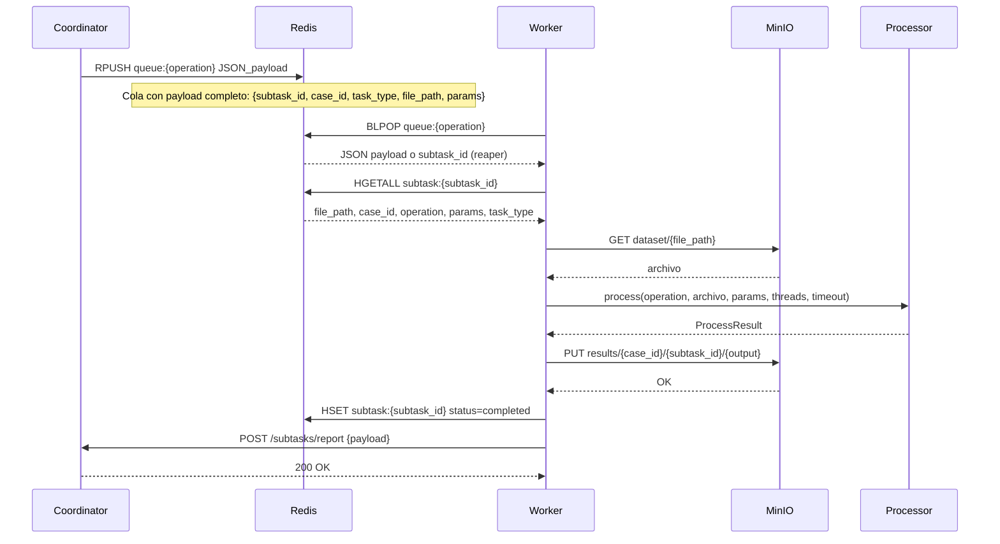
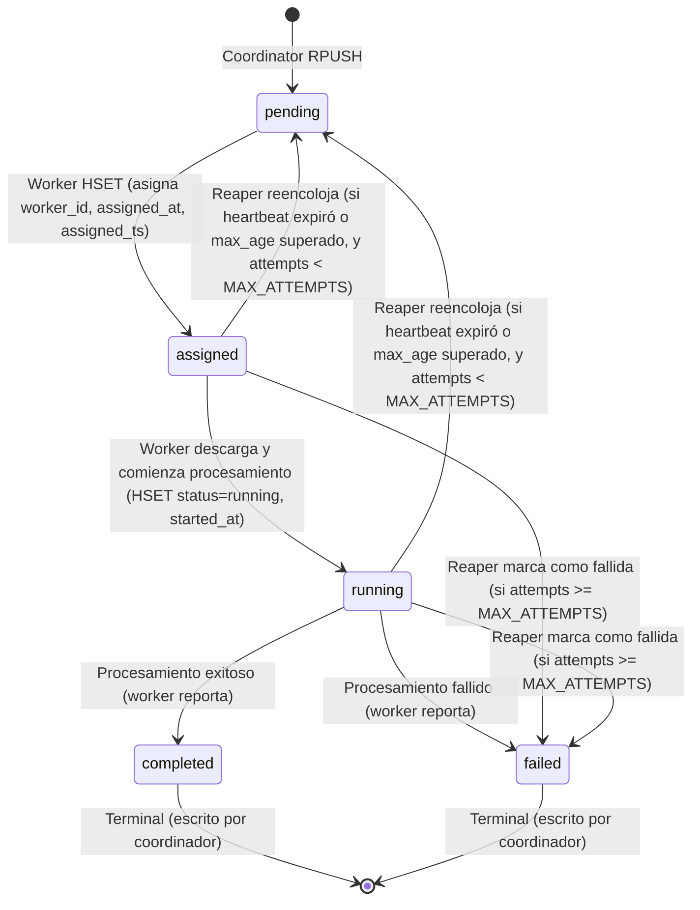

# Contrato del Worker — Referencia Técnica

Documentación para coordinadores, propietarios de dashboard y desarrolladores de la plataforma distribuida de procesamiento multimedia.

## Resumen del flujo

El coordinador envía identificadores de subtareas (`subtask_id`) a colas Redis específicas por operación. El worker extrae tareas, descarga el archivo de entrada desde MinIO, procesa con `multimedia_processor`, carga los resultados a MinIO y reporta al coordinador mediante HTTP.

### Diagrama de secuencia



### Diagrama de estados de subtarea



## Colas de tareas

Cinco operaciones definidas en `OPERATIONS`, cada una con su propia cola Redis:

| Operación | Clave Redis | Descripción |
|-----------|-------------|-------------|
| `transcode_video` | `queue:transcode_video` | Recodificar video a H.264 + AAC en MP4 |
| `extract_audio` | `queue:extract_audio` | Extraer pista de audio de video a MP3 |
| `generate_thumbnail` | `queue:generate_thumbnail` | Generar fotograma JPEG como miniatura |
| `convert_audio` | `queue:convert_audio` | Convertir audio (WAV, AAC, FLAC) a MP3 |
| `extract_metadata` | `queue:extract_metadata` | Extraer JSON de ffprobe (formato, streams, duración) |

El worker se suscribe a un subconjunto mediante `WORKER_QUEUES` (por defecto todas 5). El ordenamiento de colas en `BLPOP()` determina la prioridad: primera cola tiene prioridad más alta.

Ver `docs/OPERATIONS.md` para detalles de cada operación.

## Estados de una subtarea

Una subtarea transita por estos estados:

- **pending**: inicial; reencolado por el reaper si el worker muere o si tarda más de `MAX_AGE`
- **assigned**: worker adquiere la tarea; escribe `status`, `worker_id`, `assigned_at`, `assigned_ts`, incrementa `attempts`
- **running**: comienza descarga y procesamiento; escribe `status`, `started_at`, `progress`
- **completed**: procesamiento exitoso; escrito por el coordinador tras recibir el reporte
- **failed**: procesamiento falló o fue abandonado; escrito por coordinador o reaper

**Quién escribe qué:**
- **Worker**: `assigned`, `running`, `progress` (durante procesamiento); intenta reportar al coordinador
- **Coordinador**: `completed`, `failed` (terminal; irreversible)
- **Reaper**: reencoloja a `pending` si el worker murió antes de alcanzar `MAX_ATTEMPTS`

## Claves de Redis

### `subtask:{subtask_id}` — Hash

Metadatos y estado de una subtarea. El worker y reaper escriben; el coordinador lee y actualiza estados terminales.

| Campo | Quién escribe | Tipo | Ejemplo | Notas |
|-------|--------------|------|---------|-------|
| `case_id` | Coordinador | str | `"550e8400-e29b-41d4-a716-446655440000"` | UUID del caso padre |
| `subtask_id` | Coordinador | str | `"a0eebc99-9c0b-4ef8-bb6d-6bb9bd380a11"` | UUID único |
| `file_path` | Coordinador | str | `"dataset/video1.mp4"` | Clave en bucket `dataset` de MinIO |
| `operation` | Coordinador | str | `"transcode_video"` | Una de las 5 operaciones (campo legacy, ver `task_type`) |
| `task_type` | Coordinador | str | `"transcode_video"` | Una de las 5 operaciones (nuevo, reemplaza `operation`) |
| `params` | Coordinador | str | `'{"height":"720"}'` | JSON opcional para parámetros de procesamiento |
| `status` | Worker/Reaper/Coordinador | str | `"pending"`, `"assigned"`, `"running"`, `"completed"`, `"failed"` | Estado actual |
| `worker_id` | Worker | str | `"worker-gpu-node-01"` | Asignado cuando worker adquiere; vacío si reencolado |
| `assigned_at` | Worker | str ISO | `"2025-02-14T10:30:45.123456+00:00"` | Timestamp UTC cuando worker asume la tarea |
| `assigned_ts` | Worker | float | `1739534445.123456` | `time.time()` para cálculo del reaper (`assigned_ts`) |
| `started_at` | Worker | str ISO | `"2025-02-14T10:30:46.654321+00:00"` | Timestamp UTC inicio real del procesamiento |
| `finished_at` | Coordinador | str ISO | `"2025-02-14T10:32:15.987654+00:00"` | Timestamp UTC cuando finaliza (después del reporte) |
| `progress` | Worker | int | `0`, `50`, `100` | Porcentaje 0–100; actualizado cada ~1 segundo |
| `processing_s` | Coordinador | float | `89.333` | Tiempo de procesamiento en segundos (3 decimales) |
| `media_duration_s` | Coordinador | float | `120.5` | Duración del archivo multimedia en segundos |
| `output_bytes` | Coordinador | int | `52428800` | Bytes totales de salida (0 si fallido) |
| `outputs` | Coordinador | str | `'["results/...output.mp4"]'` | JSON array de rutas a MinIO de los outputs |
| `error` | Coordinador | str | `"roto.mp4: moov atom not found"` | Mensaje de error (vacío si exitoso) |
| `error_type` | Coordinador | str | `"CorruptInputError"` | Tipo de excepción (vacío si exitoso) |
| `encoder` | Coordinador | str | `"libx264"`, `"h264_nvenc"`, `"libmp3lame"` | Codificador usado en FFmpeg |
| `attempts` | Worker | int | `1`, `2`, `3` | Incrementado por `HINCRBY` en cada intento |
| `requeued_at` | Reaper | str ISO | `"2025-02-14T10:31:50.000000+00:00"` | Timestamp UTC del reencolamiento |
| `requeue_reason` | Reaper | str | `"worker_lost"`, `"max_age"` | Por qué el reaper reencoló |

**TTL:** Indefinido (sin expiración).

### `worker:{worker_id}` — Hash con TTL

Estado de vitalidad del worker. El heartbeat escribe cada `HEARTBEAT_INTERVAL` (5 s por defecto).

| Campo | Tipo | Ejemplo | Notas |
|-------|------|---------|-------|
| `worker_id` | str | `"worker-gpu-node-01"` | Identificador único; generado como `"worker-" + socket.gethostname()` si no se especifica |
| `host` | str | `"gpu-node-01"` | `NODE_NAME` (nombre de máquina física); en Docker es la env var `NODE_NAME` |
| `hostname` | str | `"a1b2c3d4e5f6"` | `socket.gethostname()` (en Docker: ID corto o nombre del contenedor) |
| `ip` | str | `"192.168.1.42"` | Dirección IP local (obtenida por `local_ip(REDIS_HOST)`) |
| `queues` | str | `"transcode_video,extract_audio"` | `",".join(worker_queues)` |
| `concurrency` | int | `2` | `WORKER_CONCURRENCY` |
| `threads_per_job` | int | `4` | `cpu_count // concurrency` |
| `cpu_percent` | float | `45.3` | Porcentaje de CPU actual |
| `mem_percent` | float | `62.8` | Porcentaje de memoria actual |
| `active_subtasks` | int | `2` | Tareas en vuelo (assigned + running) |
| `completed_count` | int | `142` | Contador acumulado desde startup |
| `failed_count` | int | `3` | Contador acumulado desde startup |
| `ffmpeg_version` | str | `"ffmpeg version 5.1.2"` | Primera línea de `ffmpeg -version` o `"unavailable"` |
| `gpu_encoders` | str | `"h264_nvenc,h264_qsv"` o `"none"` | Encoders de hardware **compilados** en el build de FFmpeg (`ffmpeg -encoders`). No garantiza que exista la GPU: el FFmpeg de Debian los trae aunque la máquina no tenga GPU. Para saber qué se usó realmente, ver `encoder` en el reporte de cada sub-tarea |
| `gpu` | str | `"NVIDIA GeForce RTX 3080"`, `"none"`, `"unknown"` | GPU detectada (verificada con test de encoding real) o `"none"` si no hay, `"unknown"` si no se pudo detectar |
| `nvenc_ok` | str | `"1"` o `"0"` | `"1"` si NVENC fue verificado exitosamente; `"0"` si no hay GPU o la verificación falló |
| `started_at` | str ISO | `"2025-02-14T09:00:00.000000+00:00"` | Timestamp UTC del startup del worker |
| `last_seen` | str ISO | `"2025-02-14T10:35:10.000000+00:00"` | Timestamp UTC del último heartbeat |

**TTL:** `HEARTBEAT_TTL` segundos (15 por defecto). Cuando la clave expira, el reaper considera el worker muerto.

### `cases:registry` — Set

Registro de todos los `case_id` creados. El coordinador añade (`SADD`) al crear un caso.

Miembros: `["550e8400-e29b-41d4-a716-446655440000", "a1234567-b89c-41d4-a716-446655440111", ...]`

### `case:{case_id}:subtasks` — List

Lista de subtask IDs pertenecientes al caso. El coordinador añade (`RPUSH`) al crear cada sub-tarea. Permite O(1) acceso sin SCAN.

Miembros (orden): `["a0eebc99-9c0b-4ef8-bb6d-6bb9bd380a11", "b1f9fcc00-9d0c-4fg9-cc7e-7cc0ce491b22", ...]`

### `case:{case_id}:done` — Set

Conjunto de `subtask_id` que ya reportaron (completado o fallido). El coordinador usa (`SADD`) para garantizar idempotencia: un reporte se procesa solo si el `SADD` retorna 1.

Miembros: `["a0eebc99-9c0b-4ef8-bb6d-6bb9bd380a11", "b1f9fcc00-9d0c-4fg9-cc7e-7cc0ce491b22", ...]`

### `workers:registry` — Set

Registro de todos los `worker_id` activos. El heartbeat añade (`SADD`); el reaper elimina (`SREM`) cuando muere.

Miembros: `["worker-gpu-node-01", "worker-generic-b2", ...]`

### `worker:{worker_id}:inflight` — Set

Subtareas en vuelo en este worker (estados `assigned` o `running`). El worker añade al asignar (`SADD`), elimina al reportar (`SREM`); el reaper limpia al procesar workers muertos.

Miembros: `["a0eebc99-9c0b-4ef8-bb6d-6bb9bd380a11", "b1f9fcc00-9d0c-4fg9-cc7e-7cc0ce491b22", ...]`

### `reports:pending` — List

Cola de reportes fallidos (network error, 5xx del coordinador). El worker hace `LPUSH`; el flusher en el worker (cada 15 s) y el reaper (cada ciclo) intentan reenviar.

Miembros: JSON serializado de payloads de reporte.

## Tipos de error

El campo `error_type` en reportes indica la categoría. El coordinador debe interpretar:

| `error_type` | Significado | Ejemplo |
|------------|-----------|---------|
| `UnsupportedFormatError` | Formato/stream no soportado para la operación | `"video.mp4: el archivo no contiene stream de video"` |
| `CorruptInputError` | Archivo dañado; ffprobe no puede leerlo o FFmpeg falla | `"roto.mp4: ffprobe no pudo leer el archivo: moov atom not found"` |
| `ProcessingTimeoutError` | FFmpeg superó `FFMPEG_TIMEOUT` | `"largo.mp4: FFmpeg superó el tiempo límite de 600 s"` |
| `InputNotFoundError` | Archivo de entrada no existe en MinIO | `"missing.mp4: el archivo de entrada no existe"` |
| `FFmpegNotAvailableError` | FFmpeg/ffprobe no en PATH | `"ffmpeg no está instalado o no está en el PATH"` |
| `StorageError` | Fallo de descarga/carga a MinIO | `"No se pudo descargar de MinIO: Access Denied"` |
| `InternalError` | Error inesperado (captura genérica) | Cualquier excepción no prevista |
| `WorkerLostError` | Worker murió; reaper abandonó tras `MAX_ATTEMPTS` | Reaper reporta esto, no el worker |

## Payload del reporte — POST `/subtasks/report`

```json
{
  "subtask_id": "a0eebc99-9c0b-4ef8-bb6d-6bb9bd380a11",
  "case_id": "550e8400-e29b-41d4-a716-446655440000",
  "worker_id": "worker-gpu-node-01",
  "host": "gpu-node-01",
  "status": "completed",
  "result_path": "results/550e8400-e29b-41d4-a716-446655440000/a0eebc99-9c0b-4ef8-bb6d-6bb9bd380a11/output.mp4",
  "outputs": [
    "results/550e8400-e29b-41d4-a716-446655440000/a0eebc99-9c0b-4ef8-bb6d-6bb9bd380a11/output.mp4"
  ],
  "error": null,
  "error_type": null,
  "started_at": "2025-02-14T10:30:46.654321+00:00",
  "finished_at": "2025-02-14T10:32:15.987654+00:00",
  "processing_s": 89.333,
  "media_duration_s": 120.5,
  "output_bytes": 52428800,
  "encoder": "libx264",
  "attempts": 1
}
```

### Campos

- `subtask_id`, `case_id`: identificadores UUID
- `worker_id`: ID del worker; vacío si reaper reporta (`WorkerLostError`)
- `host`: nombre de máquina física (`NODE_NAME`)
- `status`: `"completed"` o `"failed"`
- `result_path`: ruta a MinIO del primer resultado (vacía si fallido); para compatibilidad
- `outputs`: lista de rutas a MinIO en `results/{case_id}/{subtask_id}/*` (vacía si fallido)
- `error`: mensaje de error (null si exitoso); generado por el worker o reaper
- `error_type`: nombre de clase de excepción (null si exitoso)
- `started_at`: timestamp ISO UTC cuando comienza el procesamiento (después de descarga)
- `finished_at`: timestamp ISO UTC cuando finaliza
- `processing_s`: tiempo de procesamiento en segundos (redondeado a 3 decimales)
- `media_duration_s`: duración del archivo en segundos (null si no disponible o error antes de probar)
- `output_bytes`: bytes de salida (0 si fallido; suma de todos los outputs si completado)
- `encoder`: nombre del codificador usado (ej. `"libx264"`, `"libmp3lame"`, null si no aplica)
- `attempts`: número de intento en que se reportó

### Política de reintento

1. Intento inmediato en `report(payload)` del worker
2. Si falla con conexión o 5xx, reintentar con delays: 1, 2, 4, 8, 16 segundos
3. Si todos los reintentos fallan, `LPUSH` a `reports:pending`
4. Flusher en worker intenta `RPOP` y reenviar cada 15 segundos (`FLUSH_INTERVAL`)
5. Reaper también llama `flush_pending()` en cada ciclo (`REAPER_INTERVAL` = 10 s default)
6. 4xx respuestas no se reintentan (error de formato/autenticación); se descartan
7. El coordinador debe ser idempotente: ignorar reportes si `subtask_id` ya está terminal

## Algoritmo del Reaper

El reaper (`scripts/reaper.py`) se ejecuta cada `REAPER_INTERVAL` segundos (10 por defecto) en la máquina A (coordinador).

### Criterios de worker muerto

Un worker se considera muerto si:
- La clave `worker:{worker_id}` no existe (TTL expiró después de `HEARTBEAT_TTL` segundos sin que el heartbeat se renueve)

### Criterios de subtarea huérfana (con worker vivo)

Una subtarea se considera huérfana si:
- Estado es `assigned` o `running`
- Tiempo transcurrido desde `assigned_ts` supera `REAPER_MAX_AGE` segundos (2100 = 35 min por defecto)

### Flujo

1. Leer `SMEMBERS workers:registry` → lista de `worker_id`
2. Para cada worker:
   - ¿Existe `worker:{worker_id}`?
     - **NO** (muerto): para cada subtarea en `worker:{worker_id}:inflight`, llamar `_recover(subtask_id, "worker_lost")`; limpiar registro
     - **SÍ** (vivo): para cada subtarea en `worker:{worker_id}:inflight`, si `edad > REAPER_MAX_AGE`, llamar `_recover(subtask_id, "max_age")`

### Función `_recover(subtask_id, reason)`

1. Leer `subtask:{subtask_id}` → obtener `attempts`, `operation`, `case_id`, `worker_id`
2. Si `attempts < MAX_ATTEMPTS` (3 por defecto):
   - Reencola: HSET `status = "pending"`, `worker_id = ""`, `progress = 0`, `requeued_at = ISO_NOW`, `requeue_reason = reason`
   - `LPUSH queue:{operation} subtask_id` (al frente, prioridad)
   - Log: "subtarea ... reencolada tras N intentos (reason)"
3. Si `attempts >= MAX_ATTEMPTS`:
   - Fallar: crear payload con `status = "failed"`, `error_type = "WorkerLostError"`, `error = "Sub-tarea abandonada tras N intentos (reason)"`
   - Llamar `reporter.report(payload)` → intenta POST con reintentos y fallback a `reports:pending`
   - Log: "subtarea ... marcada como fallida tras N intentos (reason)"

### Configuración

| Env var | Default | Significado |
|---------|---------|-------------|
| `HEARTBEAT_INTERVAL` | 5.0 s | Intervalo de latido del worker |
| `HEARTBEAT_TTL` | 15 s | Tiempo de expiración de la clave heartbeat |
| `REAPER_INTERVAL` | 10.0 s | Intervalo de ejecución del reaper |
| `REAPER_MAX_AGE` | 2100.0 s | Edad máxima de una tarea antes de reencolarse |
| `MAX_ATTEMPTS` | 3 | Máximo número de intentos |

## Dashboard — Consultas de ejemplo

Usar `redis-cli` o librería `redis-py` desde Persona 4.

### Listar workers vivos

```bash
redis-cli -h 192.168.1.X -p 6379 -a tu_password SMEMBERS workers:registry
redis-cli -h 192.168.1.X -p 6379 -a tu_password HGETALL worker:worker-gpu-node-01
```

```python
import redis

r = redis.Redis(host='192.168.1.X', port=6379, password='tu_password', decode_responses=True)

worker_ids = r.smembers('workers:registry')
for wid in worker_ids:
    hb = r.hgetall(f'worker:{wid}')
    print(f"{hb['host']} ({hb['worker_id']}): "
          f"activas={hb.get('active_subtasks', '?')}, "
          f"completadas={hb.get('completed_count', '?')}, "
          f"fallidas={hb.get('failed_count', '?')}")
```

### Estado de una subtarea

```bash
redis-cli -h 192.168.1.X -p 6379 -a tu_password HGETALL subtask:a0eebc99-9c0b-4ef8-bb6d-6bb9bd380a11
```

```python
subtask_data = r.hgetall(f'subtask:a0eebc99-9c0b-4ef8-bb6d-6bb9bd380a11')
print(f"Status: {subtask_data.get('status')}")
print(f"Progress: {subtask_data.get('progress')}%")
print(f"Attempts: {subtask_data.get('attempts')}")
print(f"Worker: {subtask_data.get('worker_id')}")
```

### Reportes pendientes

```bash
redis-cli -h 192.168.1.X -p 6379 -a tu_password LLEN reports:pending
```

```python
pending_count = r.llen('reports:pending')
print(f"Reportes pendientes de envío: {pending_count}")
```

## Requisitos para el coordinador — v3.0

### Completados

1. **Idempotencia atómica:** SADD en `case:{id}:done` → solo el primer reporte decrementa `pending_subtasks`
2. **Validación 422:** task_type inválido retorna 422 inmediatamente; "auto" y None disparan detección por extensión
3. **Lista de subtareas por caso:** `RPUSH case:{id}:subtasks <sid>` al crear → O(1) sin SCAN
4. **Creación atómica:** pipeline(transaction=True) → todo o nada; no hay casos huérfanos
5. **Routing automático:** `router.resolve_task_type()` detecta por extensión (video → transcode_video, audio → convert_audio, otro → extract_metadata)
6. **Reporte consolidado:** `GET /cases/{id}/report` agrupa por operación, calcula promedios, desglosa errores
7. **Almacenamiento de campos:** error_type, outputs (JSON array), host, started_at, finished_at, processing_s, media_duration_s, output_bytes, encoder, attempts
8. **Aceptación de parámetros:** `POST /cases` con `params: {...}` opcional por subtarea (almacenados como JSON string en `subtask:{id}:params`)

### Pendientes

- Prioridades por caso (planificación de colas)
- Estados de caso `retrying` y `cancelled` (control de ciclo de vida completo)

## Herramientas de testing y generación de datos

**`scripts/generate_dataset.py`:** generador de casos sintéticos (100–500 casos con 2–8 sub-tareas cada uno, parámetros realistas). Útil para **stress-testing** del coordinador y distribución. **Nota importante:** los archivos generados (`dataset/case_XXXX/...`) no existen en MinIO real y los params no coinciden con `docs/OPERATIONS.md`, así que es solo para validar carga del coordinador, no para procesar medios reales. Para media real, usar `scripts/seed_minio` + `scripts/submit_case`.
