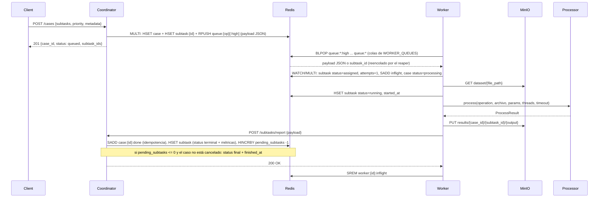
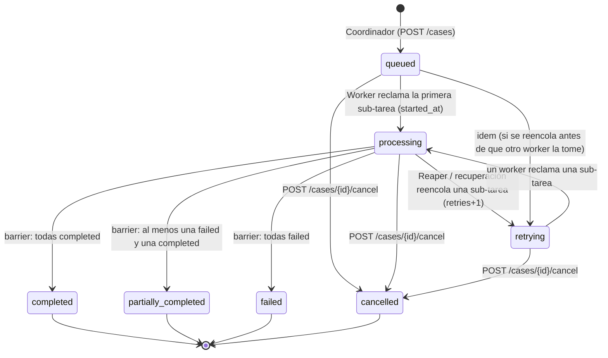

# Contrato del Worker y del Coordinador — Referencia Técnica (API v4)

Documentación para coordinadores, propietarios de dashboard y desarrolladores de la plataforma distribuida de procesamiento multimedia. El código es la fuente de verdad: `src/coordinator/main.py`, `src/coordinator/router.py`, `src/workers/*.py` y `scripts/reaper.py`. Las decisiones de diseño y su justificación están en `docs/DECISIONES_DISENO.md`.

## Resumen del flujo

1. Un cliente crea un **caso** con `POST /cases` (lista de sub-tareas, `priority` y `metadata` opcionales). El coordinador valida cada operación, guarda el caso y las sub-tareas en Redis y encola un payload JSON por sub-tarea en `queue:{operation}` (o `queue:{operation}:high` si el caso es de prioridad alta), todo en una transacción atómica.
2. Cada worker hace `BLPOP` sobre sus colas (primero las `:high`), reclama la sub-tarea con una transacción `WATCH/MULTI`, descarga el archivo desde MinIO, lo procesa con `multimedia_processor`, sube los resultados a MinIO y reporta al coordinador por HTTP (`POST /subtasks/report`).
3. El coordinador registra el reporte de forma idempotente y, cuando todas las sub-tareas reportaron, cierra el caso (barrier/join) con el estado final.
4. El reaper recupera las sub-tareas de workers caídos o colgados (reencola o las da por fallidas tras `MAX_ATTEMPTS`).

### Diagrama de secuencia



El estado terminal de la sub-tarea (`completed` / `failed`) lo escribe el **coordinador** al procesar el reporte, no el worker.

### Diagrama de estados de subtarea

```mermaid
stateDiagram-v2
    [*] --> pending: Coordinador crea la sub-tarea y la encola

    pending --> assigned: Worker reclama (HSET worker_id, assigned_at, assigned_ts; attempts+1)
    assigned --> running: Worker descargó el archivo (HSET started_at)

    running --> completed: reporte status=completed (lo escribe el coordinador)
    running --> failed: reporte status=failed (lo escribe el coordinador)

    assigned --> pending: Reaper / worker al reiniciar reencolan (attempts < MAX_ATTEMPTS)
    running --> pending: Reaper / worker al reiniciar reencolan (attempts < MAX_ATTEMPTS)

    assigned --> failed: reaper reporta WorkerLostError (attempts >= MAX_ATTEMPTS)
    running --> failed: reaper reporta WorkerLostError (attempts >= MAX_ATTEMPTS)

    pending --> cancelled: POST /cases/{id}/cancel, o el worker la toma de la cola con el caso ya cancelado
    assigned --> cancelled: recuperación de una sub-tarea huérfana de un caso cancelado
    running --> cancelled: recuperación de una sub-tarea huérfana de un caso cancelado

    completed --> [*]
    failed --> [*]
    cancelled --> [*]
```



### Diagrama de estados de caso



## Colas de tareas

Cinco operaciones definidas en `OPERATIONS` (`src/workers/config.py`) y `VALID_TASK_TYPES` (`src/coordinator/router.py`), cada una con su propia cola Redis:

| Operación | Cola normal | Cola de alta prioridad | Descripción |
|-----------|-------------|------------------------|-------------|
| `transcode_video` | `queue:transcode_video` | `queue:transcode_video:high` | Recodificar video a H.264 + AAC en MP4 |
| `extract_audio` | `queue:extract_audio` | `queue:extract_audio:high` | Extraer pista de audio de video a MP3 |
| `generate_thumbnail` | `queue:generate_thumbnail` | `queue:generate_thumbnail:high` | Generar fotograma JPEG como miniatura |
| `convert_audio` | `queue:convert_audio` | `queue:convert_audio:high` | Convertir audio (WAV, AAC, FLAC...) a MP3 |
| `extract_metadata` | `queue:extract_metadata` | `queue:extract_metadata:high` | Extraer JSON de ffprobe (formato, streams, duración) |

Son 10 colas en total. El coordinador elige la cola con `router.queue_key(op, priority)`: los casos `priority="high"` van a `queue:{op}:high`; los `normal` (por defecto) a `queue:{op}`.

El worker se suscribe a un subconjunto de operaciones mediante `WORKER_QUEUES` (por defecto las 5). El orden de las claves en `BLPOP` (`Settings.queue_keys()`) da la prioridad: primero todas las colas `:high` de sus operaciones (en el orden de `WORKER_QUEUES`) y después todas las normales, también en ese orden. Un caso de prioridad alta no interrumpe lo que ya está en ejecución; solo se atiende antes en cuanto un worker queda libre.

Los elementos de la cola son el payload JSON del coordinador (`{subtask_id, case_id, task_type, file_path, params, priority}`) o un `subtask_id` simple (lo que encola el reaper). El worker acepta ambos (`Worker._parse_queue_item`) y siempre relee el hash `subtask:{id}`, que es la fuente de verdad.

El reaper y la recuperación del propio worker reencolan con `LPUSH` (al frente) en la cola que corresponde a la prioridad de la sub-tarea (`queue:{op}:high` si su campo `priority` es `high`).

Ver `docs/OPERATIONS.md` para detalles de cada operación.

## Estados de un caso

| Estado | Quién lo escribe | Significado |
|--------|------------------|-------------|
| `queued` | Coordinador (`POST /cases`) | Creado y encolado; ningún worker ha tomado aún una sub-tarea |
| `processing` | Worker (`_claim_subtask`) | Un worker reclamó una sub-tarea (desde `queued` o `retrying`); también se fija `started_at` la primera vez |
| `retrying` | Reaper / recuperación (`recovery._requeue`) | Se reencoló una sub-tarea; se incrementa `retries`. Vuelve a `processing` cuando un worker reclama de nuevo |
| `completed` | Coordinador (barrier) | Todas las sub-tareas `completed` |
| `partially_completed` | Coordinador (barrier) | Al menos una `failed` y al menos una `completed` |
| `failed` | Coordinador (barrier) | Todas las sub-tareas `failed` |
| `cancelled` | Coordinador (`POST /cases/{id}/cancel`) | Cancelado por el cliente. Es terminal: los reportes tardíos siguen registrándose pero el estado no cambia |

Terminales: `completed`, `partially_completed`, `failed`, `cancelled`. Cancelar un caso ya terminal responde `409`; un caso inexistente, `404`.

## Estados de una subtarea

| Estado | Quién lo escribe | Detalle |
|--------|------------------|---------|
| `pending` | Coordinador al crear; reaper/recuperación al reencolar | Encolada, esperando worker (`worker_id` vacío) |
| `assigned` | Worker | Reclamada; escribe `worker_id`, `assigned_at`, `assigned_ts` e incrementa `attempts` |
| `running` | Worker | Archivo descargado; escribe `started_at` y `progress` |
| `completed` | Coordinador (reporte) | Procesamiento exitoso |
| `failed` | Coordinador (reporte) | El worker reportó fallo, o el reaper reportó `WorkerLostError` |
| `cancelled` | Coordinador (cancelar), worker (la encontró en cola con el caso cancelado) o recuperación | La sub-tarea no se ejecutará (o su resultado ya no importa) |

**Quién escribe qué:**

- **Coordinador**: crea el caso y las sub-tareas (`pending`); al recibir reportes fija `completed`/`failed` y todas las métricas; al cancelar marca `cancelled` las sub-tareas `pending`.
- **Worker**: `assigned`, `running`, `progress`, `attempts`; además pasa el caso a `processing`. Reporta el resultado por HTTP.
- **Reaper** (y el worker al reiniciar, con el mismo código en `src/workers/recovery.py`): devuelve a `pending` las sub-tareas huérfanas y marca el caso `retrying`; si se agotan los intentos reporta `failed` con `WorkerLostError`.

## Claves de Redis

### `case:{case_id}` — Hash

Estado del caso. Los valores son strings (Redis); `metadata` es un JSON serializado.

| Campo | Quién escribe | Ejemplo | Notas |
|-------|---------------|---------|-------|
| `case_id` | Coordinador | `"550e8400-..."` | UUID (o el `case_id` que envió el cliente) |
| `status` | Coordinador / Worker / Reaper | `"queued"` | Ver "Estados de un caso" |
| `total_subtasks` | Coordinador | `"5"` | Número de sub-tareas |
| `pending_subtasks` | Coordinador | `"3"` | Empieza en `total`; `HINCRBY -1` por cada reporte nuevo y por cada sub-tarea cancelada. Al llegar a 0 se cierra el caso |
| `created_at` | Coordinador | ISO UTC | |
| `priority` | Coordinador | `"normal"` / `"high"` | |
| `metadata` | Coordinador | `'{"name":"homogeneo-lote_v01-1"}'` | JSON libre enviado por el cliente (`{}` si no envió) |
| `retries` | Coordinador (init `"0"`) / Reaper | `"1"` | Se incrementa cada vez que se reencola una sub-tarea del caso |
| `started_at` | Worker | ISO UTC | Cuando la primera sub-tarea pasa a `assigned` |
| `finished_at` | Coordinador | ISO UTC | Al cerrar el barrier o al cancelar |
| `cancelled_at` | Coordinador | ISO UTC | Solo si se canceló |

### `subtask:{subtask_id}` — Hash

Metadatos y estado de una subtarea. TTL: indefinido.

| Campo | Quién escribe | Tipo | Ejemplo | Notas |
|-------|--------------|------|---------|-------|
| `case_id` | Coordinador | str | `"550e8400-..."` | UUID del caso padre |
| `subtask_id` | Coordinador | str | `"a0eebc99-..."` | UUID único |
| `file_path` | Coordinador | str | `"boda_garcia/video_0015_light.webm"` | Clave del objeto en el bucket `dataset` de MinIO (sin el nombre del bucket) |
| `operation` | Coordinador | str | `"transcode_video"` | Operación resuelta. **Es el campo que lee el worker** |
| `task_type` | Coordinador | str | `"transcode_video"` | Mismo valor; lo usan el reporte y las consultas del coordinador |
| `params` | Coordinador | str | `'{"height":720}'` | JSON con parámetros de procesamiento (`{}` si no hay) |
| `metadata` | Coordinador | str | `'{"event":"boda_garcia","size_class":"light"}'` | JSON libre de la sub-tarea (`run_load` y `generate_dataset` envían los metadatos del manifiesto) |
| `priority` | Coordinador | str | `"normal"` / `"high"` | Copia de la prioridad del caso; decide a qué cola se reencola |
| `status` | Coordinador / Worker / Reaper | str | `"pending"`, `"assigned"`, `"running"`, `"completed"`, `"failed"`, `"cancelled"` | Estado actual |
| `worker_id` | Worker (reclamo) / Coordinador (reporte) | str | `"worker-gpu-node-01"` | Vacío si se reencoló |
| `assigned_at` | Worker | str ISO | `"2026-09-29T10:30:45.123456+00:00"` | UTC cuando el worker reclama |
| `assigned_ts` | Worker | float | `1739534445.123456` | `time.time()`; el reaper lo usa para `REAPER_MAX_AGE` |
| `started_at` | Worker | str ISO | | Inicio real del procesamiento (después de la descarga); el reporte lo reescribe con el mismo valor |
| `finished_at` | Coordinador | str ISO | | Lo trae el reporte del worker |
| `progress` | Worker | int | `0`, `50`, `100` | Porcentaje 0–100; se actualiza como máximo cada ~1 s |
| `host` | Coordinador | str | `"gpu-node-01"` | `NODE_NAME` del worker que reportó |
| `processing_s` | Coordinador | float | `89.333` | Segundos de procesamiento (desde el reclamo) |
| `media_duration_s` | Coordinador | float | `120.5` | Duración del archivo multimedia |
| `output_bytes` | Coordinador | int | `52428800` | Bytes totales de salida (0 si falló) |
| `outputs` | Coordinador | str | `'["results/<caso>/<subtarea>/salida.mp4"]'` | JSON array de referencias `bucket/clave` en MinIO |
| `error` | Coordinador | str | `"roto.mp4: moov atom not found"` | Vacío si exitoso |
| `error_type` | Coordinador | str | `"CorruptInputError"` | Vacío si exitoso |
| `encoder` | Coordinador | str | `"libx264"`, `"h264_nvenc"`, `"libmp3lame"` | Codificador realmente usado |
| `attempts` | Worker | int | `1`, `2`, `3` | `HINCRBY` en cada reclamo; el reporte lo reescribe |
| `requeued_at` | Reaper | str ISO | | Momento del reencolado |
| `requeue_reason` | Reaper | str | `"worker_lost"`, `"max_age"`, `"worker_restart"` | Por qué se reencoló (o por qué se abandonó) |

### `worker:{worker_id}` — Hash con TTL

Estado de vitalidad del worker. El heartbeat escribe cada `HEARTBEAT_INTERVAL` (5 s por defecto).

| Campo | Tipo | Ejemplo | Notas |
|-------|------|---------|-------|
| `worker_id` | str | `"worker-gpu-node-01"` | Único; si no se define `WORKER_ID` se genera como `"worker-" + socket.gethostname()` |
| `host` | str | `"gpu-node-01"` | `NODE_NAME` (nombre de la máquina física). En Docker el hostname es el ID del contenedor, por eso se usa `NODE_NAME` |
| `hostname` | str | `"a1b2c3d4e5f6"` | `socket.gethostname()` |
| `ip` | str | `"192.168.1.42"` | IP local usada para llegar a Redis (`local_ip(REDIS_HOST)`) |
| `queues` | str | `"transcode_video,extract_audio"` | `WORKER_QUEUES` |
| `concurrency` | int | `2` | `WORKER_CONCURRENCY` |
| `threads_per_job` | int | `4` | `cpu_count // concurrency` (mínimo 1) |
| `cpu_percent` | float | `45.3` | CPU actual (psutil) |
| `mem_percent` | float | `62.8` | Memoria actual (psutil) |
| `active_subtasks` | int | `2` | Sub-tareas en vuelo (assigned + running) |
| `completed_count` | int | `142` | Acumulado desde el arranque del worker |
| `failed_count` | int | `3` | Acumulado desde el arranque del worker |
| `ffmpeg_version` | str | `"ffmpeg version 7.1..."` | Primera línea de `ffmpeg -version` o `"unavailable"` |
| `gpu_encoders` | str | `"h264_nvenc,h264_qsv"` o `"none"` | Encoders de hardware **compilados** en FFmpeg (`ffmpeg -encoders`). No garantiza que exista la GPU: el FFmpeg de Debian los lista aunque la máquina no tenga GPU. Para saber qué se usó realmente, ver `encoder` en el reporte de cada sub-tarea |
| `gpu` | str | `"NVIDIA GeForce RTX 3080"`, `"none"`, `"unknown"` | GPU verificada con una codificación NVENC real (`detect_hw_encoders`); `"none"` si no hay, `"unknown"` si no se pudo detectar |
| `nvenc_ok` | str | `"1"` o `"0"` | `"1"` si NVENC funcionó en la prueba real |
| `hwaccel` | str | `"nvenc"` o `"none"` | Aceleración solicitada por el worker (`HWACCEL`); `transcode_video` la usa con respaldo automático a CPU |
| `started_at` | str ISO | | Arranque del worker |
| `last_seen` | str ISO | | Último heartbeat |

**TTL:** `HEARTBEAT_TTL` segundos (15 por defecto), renovado en cada latido. Cuando la clave expira, el reaper considera muerto al worker y `GET /workers` lo muestra con `alive: false`.

### `cases:registry` — Set

Todos los `case_id` creados. El coordinador añade (`SADD`) al crear un caso; lo usan `GET /cases` y `GET /stats`.

### `case:{case_id}:subtasks` — List

Sub-tareas del caso, en orden. El coordinador hace `RPUSH` al crear cada una. Permite acceso directo sin `SCAN`.

### `case:{case_id}:done` — Set

`subtask_id` que ya reportaron (completadas o fallidas) o que se cancelaron. El coordinador hace `SADD`: un reporte solo se procesa si el `SADD` devuelve 1; si devuelve 0 es un duplicado y se responde 200 sin tocar contadores.

### `workers:registry` — Set

Todos los `worker_id` conocidos. El heartbeat añade (`SADD`); el reaper elimina (`SREM`) cuando detecta que el worker murió.

### `worker:{worker_id}:inflight` — Set

Sub-tareas en vuelo en este worker (`assigned` o `running`). El worker añade al reclamar (dentro de la transacción de reclamo) y elimina al reportar; el reaper lo consulta para recuperar las sub-tareas de un worker muerto y lo borra después.

### `reports:pending` — List

Reportes que no pudieron entregarse (error de red o 5xx del coordinador). El worker hace `LPUSH`; el flusher del worker (cada 15 s) y el reaper (cada ciclo) intentan reenviarlos con `RPOP`.

### Colas `queue:{operation}` y `queue:{operation}:high` — List

Ver "Colas de tareas".

## API HTTP del coordinador (v4)

Swagger interactivo en `/docs`. Los valores de los hashes de Redis se devuelven como strings salvo donde se indica.

| Método y ruta | Uso | Respuesta principal |
|---------------|-----|---------------------|
| `POST /cases` | Crear un caso (`subtasks[]`, `priority`, `metadata`, `case_id` opcional) | `201 {case_id, status:"queued", priority, total_subtasks, subtask_ids, created_at}`; `422` si no hay sub-tareas, la operación es inválida o `priority` no es `normal`/`high` |
| `POST /subtasks/report` | Lo usan workers y reaper | `200 {message, subtask_id, case_id, subtask_status, case_status, pending_subtasks}`; duplicado: `200 {message:"Reporte ignorado por idempotencia", case_status}`; `404` sub-tarea desconocida; `422` status inválido |
| `POST /cases/{id}/cancel` | Cancelar un caso | `200 {case_id, status:"cancelled", cancelled_subtasks, running_subtasks}`; `404` / `409` (ya terminal) |
| `GET /cases[?status=]` | Listar casos, más recientes primero; filtro opcional por estado | Lista de hashes de caso |
| `GET /cases/{id}` | Caso + sub-tareas | `{"case": {hash}, "subtasks": [hash, ...]}` (crudo: `params`, `metadata` y `outputs` son JSON en string) |
| `GET /cases/{id}/report` | Reporte consolidado | Ver abajo |
| `GET /subtasks/{id}` | Una sub-tarea | Hash con `outputs` (lista), `params` y `metadata` (objetos) ya parseados |
| `GET /workers` | Workers de `workers:registry` | Lista `[{...campos del heartbeat, "worker_id", "alive"}]`; `alive` es `false` si la clave `worker:{id}` ya expiró |
| `GET /stats` | Vista rápida del sistema | `{queues, cases_by_status, workers_alive, workers_total, subtasks_active}` |

Reglas del `POST /cases`:

- `task_type` de cada sub-tarea: una de las 5 operaciones, `"auto"` u omitido. Con `auto`, `router.resolve_task_type()` decide por extensión: video (`.mp4 .mkv .avi .mov .webm .flv .wmv .m4v`) → `transcode_video`; audio (`.mp3 .wav .flac .ogg .m4a .aac .opus .wma`) → `convert_audio`; cualquier otro → `extract_metadata`.
- `params` y `metadata` por sub-tarea, y `metadata` por caso, son opcionales y de forma libre. Los parámetros desconocidos los ignora el procesador (ver `docs/OPERATIONS.md`, sección 3).
- La validación de todas las operaciones ocurre antes de escribir en Redis; la escritura es una sola transacción (`MULTI/EXEC`), por lo que nunca quedan casos huérfanos.

Semántica de `POST /cases/{id}/cancel`:

1. El caso pasa a `cancelled` (con `cancelled_at` y `finished_at`).
2. Las sub-tareas `pending` pasan a `cancelled`, se agregan a `case:{id}:done` y se descuentan de `pending_subtasks`.
3. Las sub-tareas `assigned`/`running` **no se interrumpen**: terminan y reportan (se cuentan en `running_subtasks`); sus salidas quedan en MinIO, pero el caso permanece `cancelled`.
4. Los elementos que aún estén en las colas se descartan solos: al reclamarlos, el worker ve el caso cancelado y marca la sub-tarea `cancelled` sin procesarla.

### Reporte consolidado — `GET /cases/{id}/report`

Campos de primer nivel:

| Campo | Contenido |
|-------|-----------|
| `case_id`, `status`, `created_at`, `finished_at` | Datos del caso |
| `priority` | `normal` / `high` |
| `metadata` | Objeto (parseado) |
| `retries` | Reencolados del caso |
| `summary` | Texto, p. ej. `"7 ok; 1 fallida(s) (1 CorruptInputError)"` |
| `totals` | `{total, completed, failed, pending}` |
| `failure_breakdown` | `{error_type: cantidad}` |
| `avg_processing_s_by_operation`, `avg_processing_s_by_host` | Promedios en segundos |
| `subtasks_by_operation` | `{operación: [sub-tarea, ...]}` |
| `subtasks_by_type` | `{"video" \| "audio" \| "other": [sub-tarea, ...]}` (por extensión del archivo) |
| `totals_by_type_and_operation` | `{tipo: {operación: {completed, failed, other}}}` |

Cada sub-tarea del reporte incluye: `subtask_id`, `file_path`, `status`, `worker_id`, `host`, `started_at`, `finished_at`, `processing_s`, `media_duration_s`, `output_bytes`, `outputs` (lista), `error`, `error_type`, `attempts`, `encoder`, `metadata` (objeto), `priority` y `file_type` (`video`/`audio`/`other`).

## Tipos de error

El campo `error_type` en reportes indica la categoría:

| `error_type` | Significado | Ejemplo |
|------------|-----------|---------|
| `UnsupportedFormatError` | Formato/stream no soportado para la operación | `"video.mp4: el archivo no contiene stream de video"` |
| `CorruptInputError` | Archivo dañado; ffprobe no puede leerlo o FFmpeg falla | `"roto.mp4: ffprobe no pudo leer el archivo: moov atom not found"` |
| `ProcessingTimeoutError` | FFmpeg superó el tiempo límite (proporcional a la duración, o `FFMPEG_TIMEOUT` si se define) | `"largo.mp4: FFmpeg superó el tiempo límite de 600 s"` |
| `InputNotFoundError` | El archivo de entrada no existe | `"missing.mp4: el archivo de entrada no existe"` |
| `FFmpegNotAvailableError` | FFmpeg/ffprobe no están en el PATH | `"ffmpeg no está instalado o no está en el PATH"` |
| `StorageError` | Fallo de descarga/carga en MinIO (p. ej. la clave no existe en el bucket `dataset`) | `"failed to download 'x.mp4' from bucket 'dataset'"` |
| `InternalError` | Error inesperado (captura genérica) | Cualquier excepción no prevista |
| `WorkerLostError` | El worker murió y el reaper abandonó la sub-tarea tras `MAX_ATTEMPTS` | Lo reporta el reaper, no el worker |

## Payload del reporte — POST `/subtasks/report`

```json
{
  "subtask_id": "a0eebc99-9c0b-4ef8-bb6d-6bb9bd380a11",
  "case_id": "550e8400-e29b-41d4-a716-446655440000",
  "worker_id": "worker-gpu-node-01",
  "host": "gpu-node-01",
  "status": "completed",
  "result_path": "results/550e8400-e29b-41d4-a716-446655440000/a0eebc99-9c0b-4ef8-bb6d-6bb9bd380a11/output.mp4",
  "outputs": [
    "results/550e8400-e29b-41d4-a716-446655440000/a0eebc99-9c0b-4ef8-bb6d-6bb9bd380a11/output.mp4"
  ],
  "error": null,
  "error_type": null,
  "started_at": "2026-09-29T10:30:46.654321+00:00",
  "finished_at": "2026-09-29T10:32:15.987654+00:00",
  "processing_s": 89.333,
  "media_duration_s": 120.5,
  "output_bytes": 52428800,
  "encoder": "libx264",
  "attempts": 1
}
```

El modelo `SubtaskReport` del coordinador no declara `result_path`; el campo se envía por compatibilidad y se ignora.

### Campos

- `subtask_id`, `case_id`: identificadores UUID
- `worker_id`: ID del worker; vacío si reporta el reaper por `WorkerLostError`
- `host`: nombre de la máquina física (`NODE_NAME`); `"reaper"` si lo reporta el reaper
- `status`: `"completed"` o `"failed"` (cualquier otro valor: 422)
- `outputs`: referencias `bucket/clave` en `results/{case_id}/{subtask_id}/*` (vacía si falló)
- `error`, `error_type`: `null` si exitoso
- `started_at`, `finished_at`: ISO UTC; el inicio se toma después de la descarga
- `processing_s`: segundos (3 decimales)
- `media_duration_s`: duración del medio (`null` si no se pudo probar)
- `output_bytes`: 0 si falló; suma de las salidas si completó
- `encoder`: codificador usado (`libx264`, `h264_nvenc`, `libmp3lame`; `null` si no aplica)
- `attempts`: número de intento en que se reportó

### Política de reintento del reporte

1. Intento inmediato en `Reporter.report(payload)`.
2. Si falla con error de conexión, timeout o 5xx: reintentos con esperas de 1, 2, 4, 8 y 16 s.
3. Si todos fallan, `LPUSH` a `reports:pending`.
4. El flusher del worker (cada 15 s, `FLUSH_INTERVAL`) y el reaper (en cada ciclo) reenvían con `RPOP`; si sigue fallando el reporte vuelve a la cola.
5. Una respuesta 4xx no se reintenta (error de formato); se descarta y se registra en el log.
6. **Idempotencia**: el coordinador hace `SADD case:{id}:done <subtask_id>`; solo el primer reporte de cada sub-tarea modifica el estado, así que los reenvíos (por respuesta HTTP perdida o vaciado de `reports:pending`) no cuentan dos veces ni cierran el caso antes de tiempo.

## Algoritmo del Reaper

El reaper (`scripts/reaper.py`) corre en la máquina A cada `REAPER_INTERVAL` segundos (10 por defecto). En cada ciclo también llama `reporter.flush_pending()`. La lógica de recuperación de una sub-tarea está en `src/workers/recovery.py` y la comparte el worker.

### Criterios

- **Worker muerto**: la clave `worker:{worker_id}` no existe (el heartbeat no se renovó durante `HEARTBEAT_TTL` s). Tiempo típico de detección: hasta `HEARTBEAT_TTL + REAPER_INTERVAL` ≈ 25 s.
- **Sub-tarea colgada con worker vivo**: estado `assigned`/`running` y `now - assigned_ts > REAPER_MAX_AGE` (2100 s = 35 min por defecto).
- **Worker que reinicia con el mismo `WORKER_ID`**: al arrancar, `Worker.recover_own_inflight()` recupera las sub-tareas que quedaron en su `worker:{id}:inflight` (razón `worker_restart`), sin esperar al reaper.

### Flujo

1. `SMEMBERS workers:registry`.
2. Para cada worker: si `worker:{id}` no existe, recuperar todo su `inflight` con razón `worker_lost`, borrar `worker:{id}:inflight` y hacer `SREM workers:registry`. Si está vivo, recuperar las sub-tareas de su `inflight` que superen `REAPER_MAX_AGE` (razón `max_age`) y limpiar las que ya no estén activas.

### `recover_subtask(sub-tarea, reason)`

1. Lee `subtask:{id}`. Si no está en `assigned`/`running`, no hay nada que recuperar.
2. Si el caso está `cancelled`: la sub-tarea pasa a `cancelled` y no se reencola.
3. Si `attempts < MAX_ATTEMPTS` (3 por defecto), en una transacción `WATCH/MULTI`: `status = pending`, `worker_id = ""`, `progress = 0`, `requeued_at`, `requeue_reason`; `LPUSH` a `queue:{operation}` o `queue:{operation}:high` según `priority`; si el caso no es terminal, pasa a `retrying` y `retries += 1`.
4. Si `attempts >= MAX_ATTEMPTS`: se arma un reporte `failed` con `error_type = "WorkerLostError"` y `error = "Sub-tarea abandonada tras N intentos (reason)"` y se envía con `Reporter.report()` (con reintentos y respaldo en `reports:pending`).

### Configuración

| Variable | Default | Significado |
|----------|---------|-------------|
| `HEARTBEAT_INTERVAL` | 5.0 s | Intervalo de latido del worker |
| `HEARTBEAT_TTL` | 15 s | Expiración de la clave `worker:{id}` |
| `REAPER_INTERVAL` | 10.0 s | Intervalo de ejecución del reaper |
| `REAPER_MAX_AGE` | 2100.0 s | Antigüedad máxima de una sub-tarea `assigned`/`running` antes de recuperarla |
| `MAX_ATTEMPTS` | 3 | Ejecuciones máximas por sub-tarea antes de darla por perdida |

### Variables de entorno del worker

Todas se leen en `Settings.from_env()` (`src/workers/config.py`); ver `.env.example`.

| Variable | Default | Significado |
|----------|---------|-------------|
| `REDIS_HOST`, `REDIS_PORT`, `REDIS_PASSWORD` | `localhost`, `6379`, vacío | Conexión a Redis |
| `COORDINATOR_URL` | `http://localhost:8000` | Destino de los reportes |
| `MINIO_ENDPOINT`, `MINIO_ACCESS_KEY`, `MINIO_SECRET_KEY`, `MINIO_SECURE` | `localhost:9000`, `minioadmin`, `minioadmin`, `false` | Conexión a MinIO |
| `DATASET_BUCKET`, `RESULTS_BUCKET` | `dataset`, `results` | Buckets de entrada y salida |
| `WORKER_ID` | `worker-<hostname>` | Identidad (dejar vacío al escalar con `--scale`) |
| `NODE_NAME` | hostname | Nombre de la máquina física; aparece como `host` |
| `WORKER_QUEUES` | las 5 operaciones | Operaciones que consume este nodo |
| `WORKER_CONCURRENCY` | 1 | Hilos consumidores (sub-tareas simultáneas) |
| `WORK_DIR` | `<tmp>/mm-worker` | Carpeta temporal por sub-tarea |
| `FFMPEG_TIMEOUT` | vacío | Vacío: timeout proporcional a la duración (tope 1800 s; 600 s si se desconoce) |
| `HWACCEL` | vacío | `nvenc` solo en el nodo con GPU |

## Dashboard — Consultas de ejemplo

Persona 4 puede usar la API HTTP (recomendado, sin acceso directo a Redis) o Redis directo. Ver también `docs/DEMO.md`.

### Vía API HTTP

```python
import requests

base = "http://192.168.1.X:8000"

# Vista rápida: colas, casos por estado, workers vivos
stats = requests.get(f"{base}/stats", timeout=10).json()
print(stats["cases_by_status"], stats["queues"]["queue:transcode_video"])

# Workers con su heartbeat
for w in requests.get(f"{base}/workers", timeout=10).json():
    print(w["worker_id"], "viva" if w["alive"] else "caida", w.get("cpu_percent"), w.get("gpu"))

# Una sub-tarea (outputs/params/metadata ya parseados)
st = requests.get(f"{base}/subtasks/a0eebc99-9c0b-4ef8-bb6d-6bb9bd380a11", timeout=10).json()
print(st["status"], st.get("progress"), st.get("attempts"), st["outputs"])

# Casos por estado
retrying = requests.get(f"{base}/cases", params={"status": "retrying"}, timeout=10).json()
```

### Vía Redis

```bash
redis-cli -h 192.168.1.X -p 6379 -a tu_password SMEMBERS workers:registry
redis-cli -h 192.168.1.X -p 6379 -a tu_password HGETALL worker:worker-gpu-node-01
redis-cli -h 192.168.1.X -p 6379 -a tu_password HGETALL subtask:a0eebc99-9c0b-4ef8-bb6d-6bb9bd380a11
redis-cli -h 192.168.1.X -p 6379 -a tu_password LLEN queue:transcode_video:high
redis-cli -h 192.168.1.X -p 6379 -a tu_password LLEN reports:pending
```

```python
import redis

r = redis.Redis(host='192.168.1.X', port=6379, password='tu_password', decode_responses=True)

for wid in r.smembers('workers:registry'):
    hb = r.hgetall(f'worker:{wid}')
    if not hb:
        continue  # heartbeat expirado: worker caído
    print(f"{hb['host']} ({hb['worker_id']}): "
          f"activas={hb.get('active_subtasks', '?')}, "
          f"completadas={hb.get('completed_count', '?')}, "
          f"fallidas={hb.get('failed_count', '?')}")

print("Reportes pendientes de envío:", r.llen('reports:pending'))
```

## Requisitos para el coordinador — v4.0

Todo lo siguiente está implementado y cubierto por `tests/test_coordinator.py` y `tests/test_contract.py`.

1. **Idempotencia atómica:** `SADD` en `case:{id}:done`; solo el primer reporte decrementa `pending_subtasks`.
2. **Validación 422:** `task_type` inválido falla antes de escribir en Redis; `"auto"`/`None` disparan la detección por extensión.
3. **Lista de subtareas por caso:** `RPUSH case:{id}:subtasks` al crear; sin `SCAN`.
4. **Creación atómica:** `pipeline(transaction=True)`; no hay casos huérfanos.
5. **Routing automático:** `router.resolve_task_type()` (video → `transcode_video`, audio → `convert_audio`, otro → `extract_metadata`).
6. **Reporte consolidado:** `GET /cases/{id}/report` agrupa por operación y por tipo de archivo, calcula promedios por operación y por host y desglosa errores.
7. **Almacenamiento de campos del worker:** `error_type`, `outputs`, `host`, `started_at`, `finished_at`, `processing_s`, `media_duration_s`, `output_bytes`, `encoder`, `attempts`.
8. **Parámetros por sub-tarea:** `params` opcional, guardado como JSON string en el campo `params` del hash `subtask:{id}`.
9. **Prioridades por caso:** `priority` (`normal`/`high`) → `queue:{op}:high`; los workers consumen primero las colas `:high`.
10. **Metadatos:** `metadata` por caso y por sub-tarea, devueltos parseados en el reporte y en `GET /subtasks/{id}`.
11. **Estados de caso completos:** `queued`, `processing`, `retrying`, `completed`, `partially_completed`, `failed`, `cancelled`.
12. **Cancelación:** `POST /cases/{id}/cancel` (409 si ya es terminal).
13. **Consulta y monitoreo:** `GET /cases?status=`, `GET /subtasks/{id}`, `GET /workers`, `GET /stats`.

Limitaciones conocidas: la cancelación no interrumpe una sub-tarea ya en ejecución; Redis es un único punto de fallo (mitigado con AOF, ver `docs/DECISIONES_DISENO.md`).

## Herramientas de testing, dataset y carga

Todas se ejecutan desde la raíz del repo con `python -m scripts.<nombre>` y leen la configuración de `.env` (`Settings.from_env()`); la excepción es `generate_dataset`, que recibe la URL del coordinador con `--url` (por defecto `http://localhost:8000`).

| Script | Propósito | Opciones principales |
|--------|-----------|----------------------|
| `build_dataset` | Genera el dataset real (480 archivos de audio/video con FFmpeg), `manifest.json`, `cases.json` y `dataset/README.md`. Se corre dentro de la imagen del worker | `--out`, `--files`, `--seed` |
| `run_load` | Sube el dataset a MinIO, envía sus casos (`cases.json`) al coordinador y mide la carga; escribe `docs/evidencia/carga_<fecha>.json` y `.md` | `--dataset`, `--upload`, `--concurrency`, `--limit`, `--kinds`, `--high-fraction` (fracción de casos con prioridad alta, 0.1), `--seed` (42), `--poll`, `--timeout`, `--out` |
| `generate_dataset` | Inyecta 100–500 casos aleatorios (2–8 sub-tareas) construidos con los **archivos reales del manifiesto** (claves reales de MinIO), operación adecuada al tipo, `params` válidos según `docs/OPERATIONS.md`, prioridad aleatoria y `metadata` del archivo | `--url`, `--manifest`, `--min-cases`, `--max-cases`, `--min-sub`, `--max-sub`, `--high-fraction`, `--exclude-problematic`, `--workers`, `--seed`, `--dry-run` |
| `submit_case` | Sube una carpeta a MinIO y crea uno o más casos; espera y muestra el reporte | `--dir`, `--prefix`, `--mode auto\|mixed\|<op>`, `--no-upload`, `--repeat`, `--priority normal\|high`, `--cancel-after SEGUNDOS`, `--timeout`, `--poll` |
| `demo_feeder` | Genera una biblioteca de medios con FFmpeg y envía casos aleatorios en bucle (demo local); ver `docs/DEMO.md` | Variables `DEMO_INTERVAL`, `DEMO_MAX_CASES` |
| `fetch_results` | Descarga a disco las salidas y el reporte (`reporte.json`, `reporte.md`) de uno o más casos | `case_id...`, `--out` (`resultados`), `--only-completed` |
| `seed_minio` | Sube un directorio local a MinIO (bucket `dataset`) | `local_dir`, `--prefix`, `--bucket` |
| `check_connectivity` | Verifica Redis, coordinador, MinIO, FFmpeg y `WORK_DIR` antes de arrancar un worker | `--create-buckets` |
| `reaper` | Servicio del reaper (`python -m scripts.reaper`) | Variables `REAPER_*`, `MAX_ATTEMPTS` |

Con `--priority`/`--high-fraction` se demuestra la prioridad; con `--cancel-after` (y en el `demo_feeder`, donde ~7 % de los casos se cancelan a los 3–6 s) se demuestra la cancelación. `run_load` y `demo_feeder` envían prioridad y metadatos; `run_load` además muestrea `GET /stats` durante la corrida y su informe incluye la comparación de duración entre prioridad alta y normal y el largo máximo de las colas.

Las claves de `file_path` que usan `run_load` y `generate_dataset` son las del manifiesto (`<evento>/<archivo>`, p. ej. `boda_garcia/video_0015_light.webm`) y existen en el bucket `dataset` una vez subido el dataset; por eso las sub-tareas se procesan realmente y no solo se encolan.
